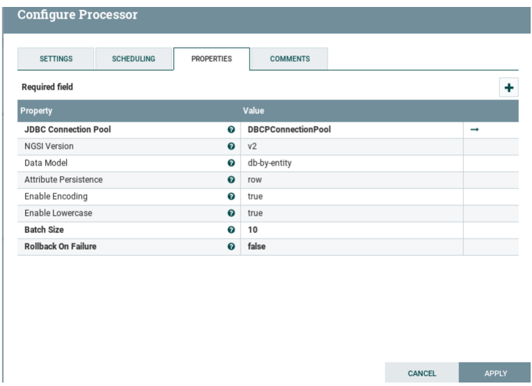

## Processors Configuration

Cygnus contains a set of processors for storing context data like NGSI events. 
This document is intended to show how to configure the NGSI processor listed 
above:

* Listen_HTTP (configured as source fro receiving notifications from Orion Context Broker)
* NGSIToMySQl (for storing NGSI events into MySQL Database)
* NGSIToPostgreSQL (for storing NGSI events into PostgreSQL Database)
* NGSIToMongo (for storing NGSI events into Mongo Database)

### Listen_HTTP Processor

Fist we need to have Cygnus up and running. Then you need to follow the 
step to add a new processor showed in the [Cygnus GUI](../installation_and_administration_guide/cygnus_gui.md) section.
Now put inside of the find field of the add processor window "Http". for filtering the processors
and select teh "ListenHTTP" processor.

The Listen HTTP processor Starts an HTTP Server and listens on a given base path to transform incoming requests into FlowFiles. The default URI of the Service will be http://{hostname}:{port}/v2/notify. Only HEAD and POST requests are supported. GET, PUT, and DELETE will result in an error and the HTTP response status code 405.
We use this NiFi native processor for receiving the HTTP notification comming from the Orion Context Broker.
The configuration needed is showed in the figure above.

Where:

|Name|Default Value|Allowable Values|Description|
|--- |--- |--- |--- |
|Base Path|contentListener| |Base path for incoming connectionsSupports, this has to match with teh notify attribute of the subscription made in ORION Expression Language: true (will be evaluated using variable registry only)|
|Listening Port| | |The Port to listen on for incoming connectionsSupports, also need to be including in the subscription, Expression Language: true (will be evaluated using variable registry only)|
|Max Data to Receive per Second| | |The maximum amount of data to receive per second; this allows the bandwidth to be throttled to a specified data rate; if not specified, the data rate is not throttled|
|SSL Context Service| |Controller Service API: RestrictedSSLContextServiceImplementation: StandardRestrictedSSLContextService|The Controller Service to use in order to obtain an SSL Context|
|Authorized DN Pattern| |.*| |A Regular Expression to apply against the Distinguished Name of incoming connections. If the Pattern does not match the DN, the connection will be refused.|
|Max Unconfirmed Flowfile Time|60 secs| |The maximum amount of time to wait for a FlowFile to be confirmed before it is removed from the cache|
|HTTP Headers to receive as Attributes (Regex)| | |Specifies the Regular Expression that determines the names of HTTP Headers that should be passed along as FlowFile attributes. You have to include at least Fiware-service, Fiware-Service-Path and Optionally X-Auth-Token|
|Return Code|200| |The HTTP return code returned after every HTTP call|

### NGSIToMySQl Processor

### NGSIToPostgreSQL Processor

### NGSIToMongo Processor
